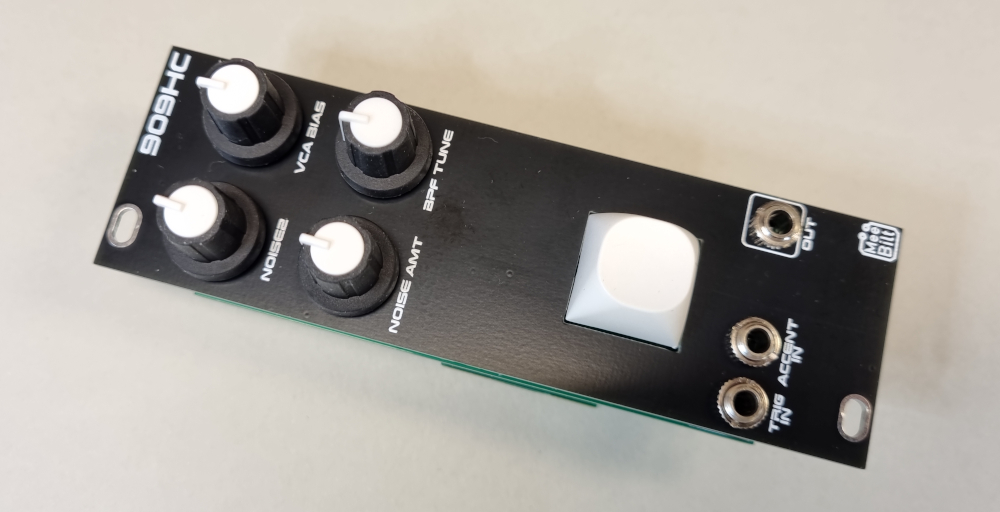

# 909-clap

This is the classic TR-909 handclap based on the HexInverter NeinOhNein Clap design. I have modified the resistor values around the pots a bit and also added a bandpass filter adjustemnt.  
This design uses the same Noise Board as the 909 Snare.

### Inputs
TRIG IN  
ACCENT IN  

### Outputs
SIGNAL OUT  

### Controls
Trigger Button  
NOISE AMT  
NOISE2  
VCA BIAS  
BPF TUNE  

### Supply
+12 VDC @ 11 mA  
-12 VDC @ 11 mA  

### Dimensions
Height: 3U  
Width: 10HP  
Depth: 35 mm  
 
### YouTube videos
[DIY Eurorack: 909 Handclap Episode 1](https://youtu.be/QJmPxyqyb7s)  
[DIY Eurorack: 909 Handclap Episode 2](https://youtu.be/BmUgnzeK77g)
