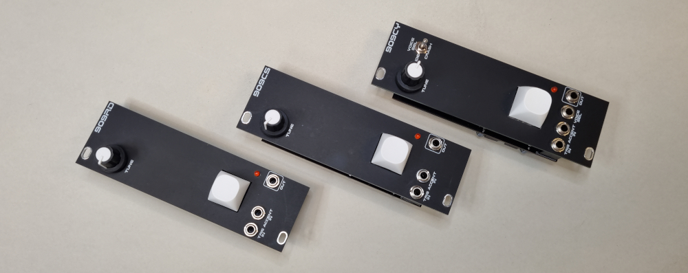

# 909-cymbals

This is the classic TR-909 cymbal voices. I have converted the design to SMT components that are easy to source.

There are three possible build option; 909CY with both voices and a switch (or control input jack) to select between them. The 909CS which is the Crash sound and 909RD which is the Ride sound.  
The 909CY needs a 64kByte EPROM to store both sounds. 909CS and 909RD uses 32kByte EPROMs. See notes in schematic diagram for details.

There are gerber files for three diffent PCB frontpanels; 909CY, 909CS or 909RD.

### Inputs
TRIG IN  
ACCENT IN  
VOICE SEL IN (909CY)  

### Outputs
SIGNAL OUT  

### Controls
Trigger Button  
TUNE  
VOICE SELECT switch (909CY)  

### Supply
+12 VDC @ 29 mA  
-12 VDC @ 7 mA  

### Dimensions
Height: 3U  
Width: 8HP  
Depth: 20 mm  
 
### YouTube videos
[Eurorack DIY: 909 Crash and Ride cymbals](https://youtu.be/4XkyfjqhyXA)
