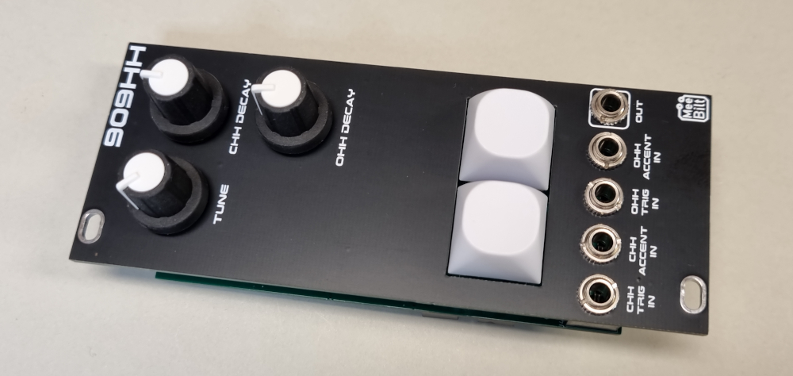

# 909-hihat

This is the classic TR-909 Hi Hat with the crispy lo-fi samples that we all love. I have converted the design to SMT components that are easy to source.  
The module features individual Open and Closed Hi-hat Trig and Accent inputs.

### Inputs
CHH TRIG IN  
CHH ACCENT IN  
OHH TRIG IN  
OHH ACCENT IN  

### Outputs
SIGNAL OUT  

### Controls
CHH and OHH Trigger Buttons  
TUNE  
CHH DECAY  
OHH DECAY  

### Supply
+12 VDC @ 15 mA (with WinBond W27E257-12)  
-12 VDC @ 7 mA  

### Dimensions
Height: 3U  
Width: 10HP  
Depth: 20 mm  
 
### YouTube videos
[DIY Eurorack: 909 HiHat Episode 1](https://youtu.be/60G6ofwSnYk)  
[DIY Eurorack: 909 HiHat Episode 2](https://youtu.be/z5UH8hfUGwE)
