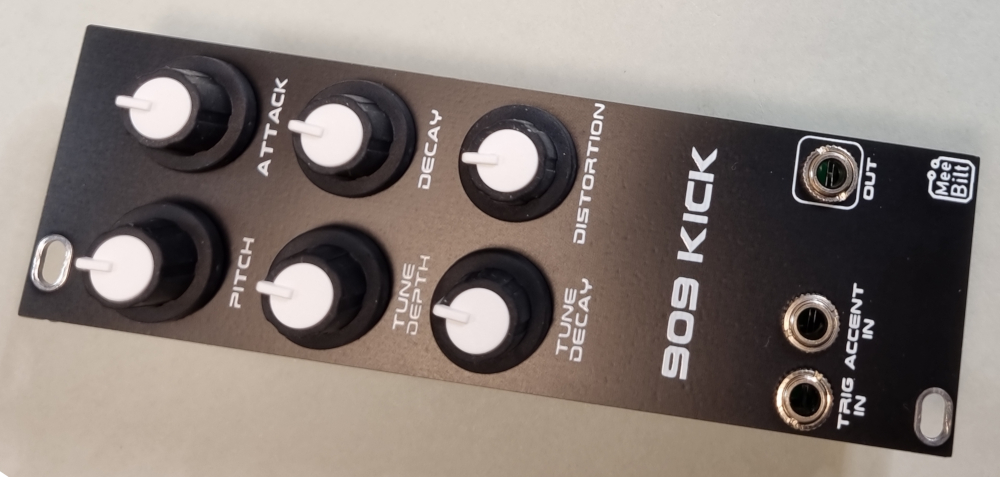

# 909-kick

This is the classic TR-909 kick drum based on the NeinOhNein Bass Drum from Hex Inverter. 
All recommended mods are added and I have converted the design to SMT components that are easy
to source.

### Inputs
TRIG IN and ACCENT IN.

### Outputs
SIGNAL OUT

### Controls
PITCH  
ATTACK  
DECAY  
TUNE DEPTH  
TUNE DECAY  
DISTORTION  

### Supply
+12 VDC @ 20 mA  
-12 VDC @ 14 mA   

### Dimensions
Height: 3U  
Width: 8HP  
Depth: 20 mm  
 
### YouTube videos
[Eurorack DIY: 909 Kick (Episode 1)](https://youtu.be/2MbjcZUPBi0)  
[Eurorack DIY: 909 Kick (Episode 2)](https://youtu.be/UFYXfUM5wMI)  
[Eurorack DIY: 909 Kick (Episode 3)](https://youtu.be/Gwy61tJjB0E)
