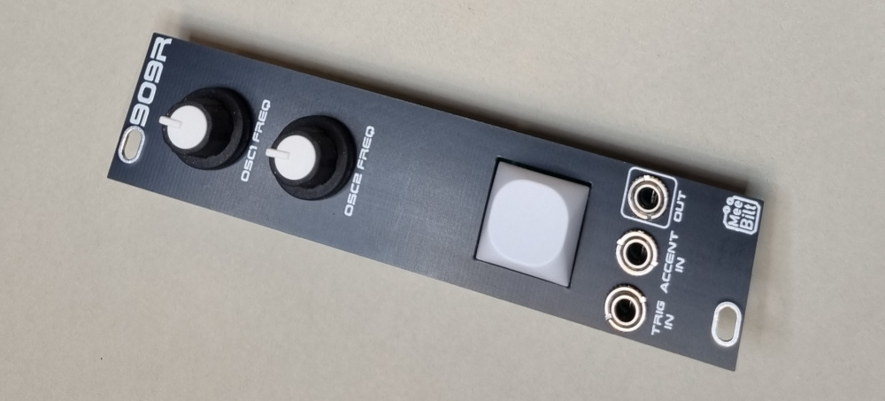

# 909-rimshot

This is the classic TR-909 rimshot voice based on the NeinOhNein Snare Drum from Hex Inverter. I have converted the design to SMT components that are easy to source.
The module has one frequency control for the top and middle oscillator and a trigger button.

### Inputs
TRIG IN and ACCENT IN.

### Outputs
SIGNAL OUT

### Controls
Trigger button  
OSC1 FREQ  
OSC2 FREQ  

### Supply
+12 VDC @ 10 mA  
-12 VDC @ 10 mA   

### Dimensions
Height: 3U  
Width: 6HP  
Depth: 25 mm  
 
### YouTube videos
[DIY Eurorack: 909 Rimshot - Analysis & Breadboarding (Episode 1)](https://youtu.be/_NQgKPawZV8)  
[DIY Eurorack: 909 Rimshot - Schematic Capture (Episode 2)](https://youtu.be/S1-vpSbkcPo)  
[DIY Eurorack: 909 Rimshot - Floorplanning (Episode 3)](https://youtu.be/T74WfJhXQas)  
[DIY Eurorack: 909 Rimshot - Routing (Episode 4)](https://youtu.be/hrbIHK0cjS0)  
[DIY Eurorack: 909 Rimshot - Manufacturing Files (Episode 5)](https://youtu.be/hICRle4JfvA)  
[DIY Eurorack: 909 Rimshot - Frontpanel (Episode 6)](https://youtu.be/C2qw4Dp-MPQ)  
[DIY Eurorack: 909 Rimshot - Build and Demo (Episode 7)](https://youtu.be/RUoL7LUl6qU)  