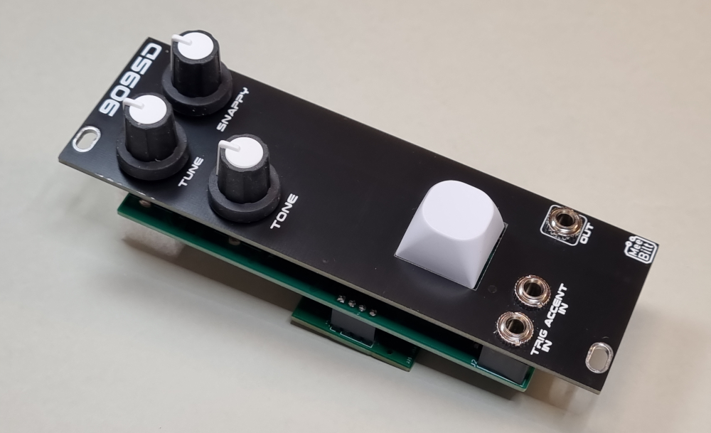

# 909-snare

This is the classic TR-909 snare drum based on the NeinOhNein Snare Drum from Hex Inverter. I have converted the design to SMT components that are easy to source.

The module needs the noise_board, which is connected as a piggy-back PCB on the back of the snare main PCB, using 2 x 4-pin header connectors.

### Inputs
TRIG IN and ACCENT IN.

### Outputs
SIGNAL OUT

### Controls
Trigger button  
TUNE  
SNAPPY  
TONE  

### Supply
+12 VDC @ 26 mA  
-12 VDC @ 21 mA   

### Dimensions
Height: 3U  
Width: 8HP  
Depth: 25 mm  
 
### YouTube videos
[DIY Eurorack: 909 Snare Episode 1](https://youtu.be/ORzMYeM-dPM)  
[DIY Eurorack: 909 Snare Episode 2](https://youtu.be/z5UH8hfUGwE)
