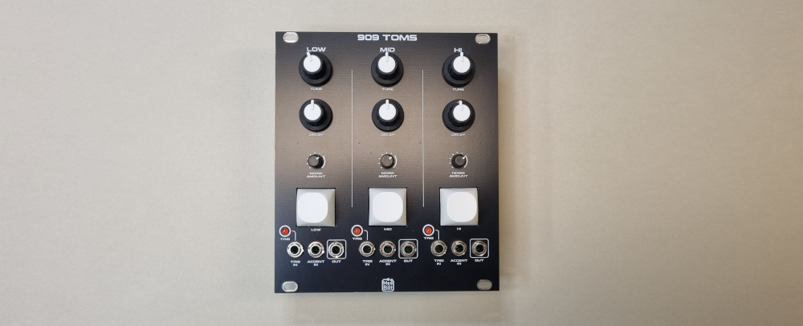

# 909-toms

This is the classic TR-909 HI, MID and LOW Toms in one big module. It's inspired by the 9090 Toms where I have based the noise circuit of the original TR-909 and also added a noise level trimmer for each voice. 

The design consists om a main board and three voice-boards; one for each Tom voice. The voice boards are identical part from that some capacitor values needs to be selected depending on if it is the HI, MID or LOW Tom voice (see table in voice board schematic diagram).  
This design also uses the same Noise Board as the 909 Snare and 909 Handclap.

### Inputs
TRIG IN (x3)  
ACCENT IN (x3) 

### Outputs
SIGNAL OUT (x3)  
TRIG Indicator LED (x3)

### Controls
Trigger Button (x3)  
TUNE (x3)  
DECAY (x3)  
NOISE AMOUNT (x3)  

### Supply
+12 VDC @ 90 mA  
-12 VDC @ 65 mA  

### Dimensions
Height: 3U  
Width: 22HP  
Depth: 30 mm  
 
### YouTube videos
[DIY Eurorack: 909 Toms](https://youtu.be/Y_JG6wYOSMI)  
