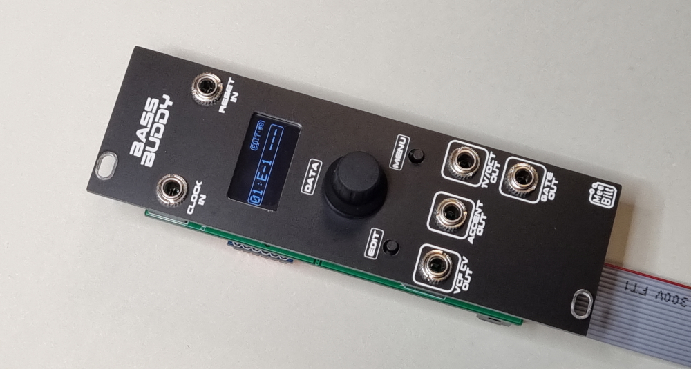

# bassbuddy

### Inputs
CLOCK input with 1 clock-pulse per step the advance is made on the low-to-high transition of the signal.  
RESET input which resets the current pattern to step 1 at the low-to-high transition.

### Outputs
GATE output that is held high during the high period of the CLOCK input signal.  
1V/OCT output with note pitch voltage (0.0833-4.0833V, C-0 to C-4)  
VCF CV output with programmable voltage 0-5V  
ACCENT output programmable On/Off  

### Steps and Patterns
A total of 10 patterns with pattern length 1-16 steps where each step have the following programmable functions:
 - Note pitch (or rest)
 - Tie note to next step
 - Slide to next step
 - VCF CV voltage

### User Interface
Consists of the 0.96" OLED, two pushbuttons and a rotary encoder with a pushbutton switch.

Press and hold encoder button to select pattern. The change will be made after the current pattern has reached the last step.

EDIT button accesses menus for editing pattern steps:
 - Select step to edit parameter in step
 - or press MENU button and edit no of repeats and next pattern in chain

MENU button accesses the following functions:
 - NEW: create a new empty pattern
 - COPY: Copy pattern
 - SAVE: Save patterns and settings to EEPROM
 - LOAD: Load patterns and settings from EEPROM
 - TUNE: Output a note on 1V/OCT output
 - VREF: Adjust DAC VRef to match +5V rail

### Supply
Two powering options, 16-pin power (or 10-pin) power connector variant showed below  
+5  VDC @ 22 mA (0 mA)  
+12 VDC @ 4 mA (26 mA)  
-12 VDC @ 5 mA (5 mA)

### YouTube video
[Eurorack DIY: Bass Sequencer for Erica Synths Bassline DIY (ep1)](https://youtu.be/X2QkwgEL9Kc)  
[Eurorack DIY: Bass Buddy - Demo, calibration and tuning (ep2)](https://youtu.be/sNX3akq5ZS8)  
[Eurorack DIY: Bass Buddy - Design update and software walk-through (ep3)](https://youtu.be/_f0KY4kPSoI)
[Eurorack DIY: Bass Buddy Build & Calibration](https://youtu.be/ylGxj2UV8lc)

### Additional information
If you plan to build this module, please check out the additional information [here](build/README.md)

### Tindie Store items
[Bass Buddy sequencer Eurorack module [PCB kit]](https://www.tindie.com/products/26946/)  
[Bass Buddy sequencer Eurorack module [Full kit]](https://www.tindie.com/products/27346/)
