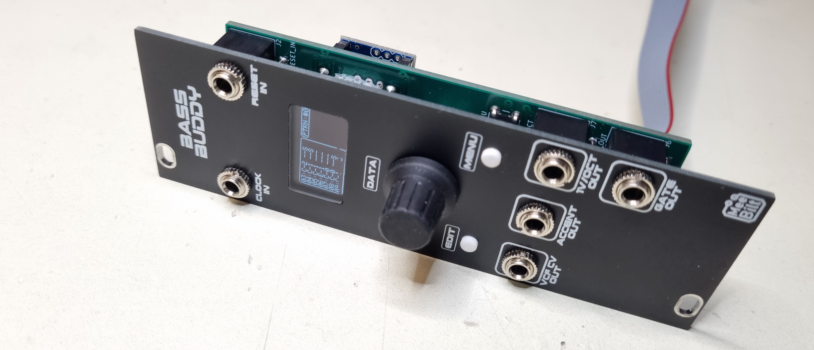
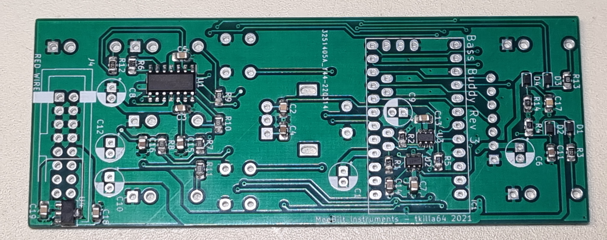
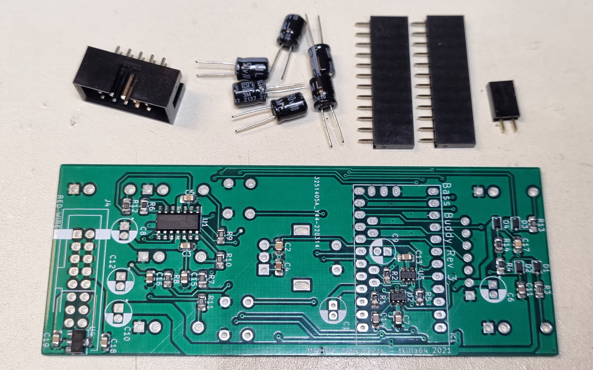
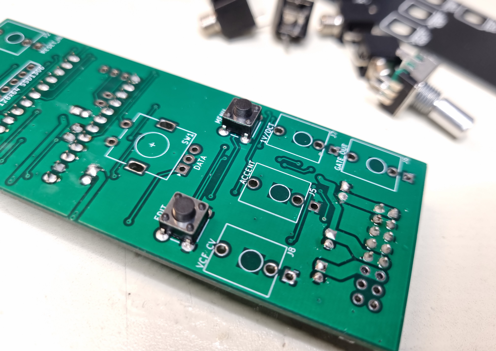
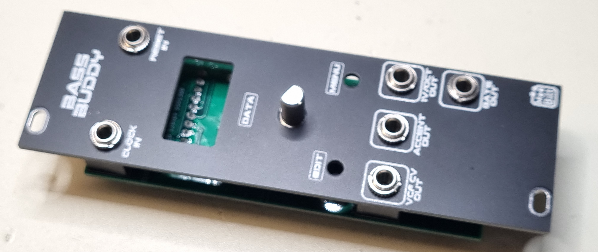
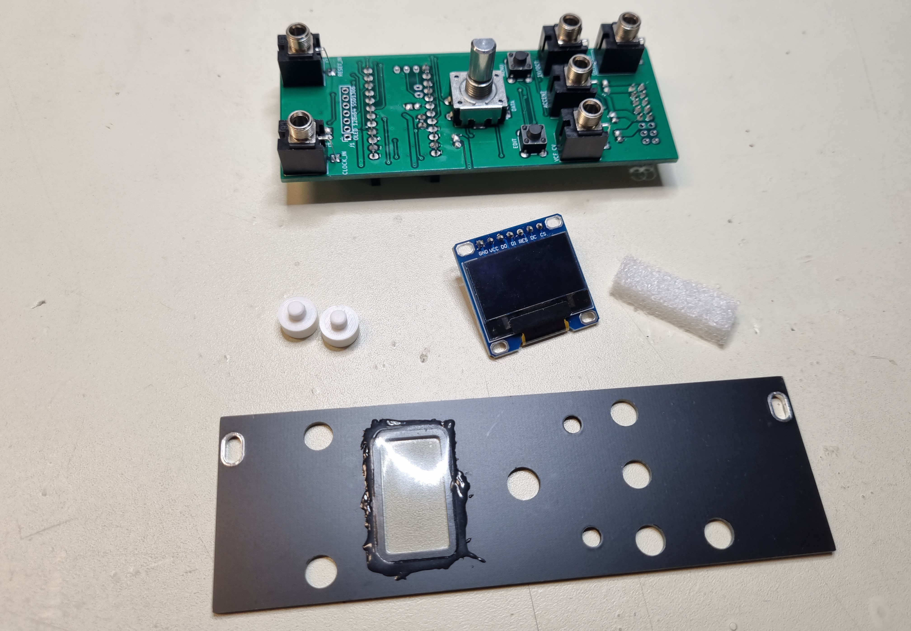
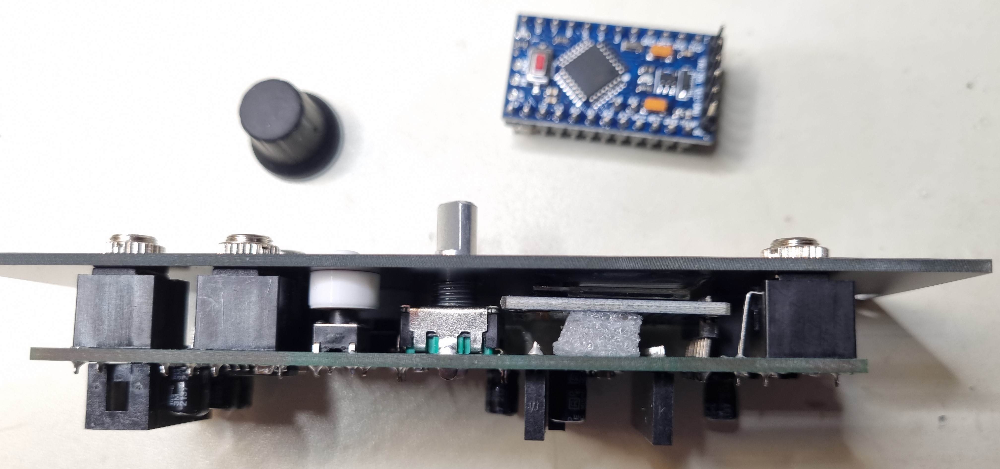

# Assembly Notes [WIP]

### Files
All the needed files can be found in this repository. 

PCB Gerber files zip-files can be uploaded directly to JLCPCB for both the main board and the front-panel. Other online PCB manufacturers may also work, but I haven't tested that.

The mech-folder contain STL-files for the transparent lens and the key-top. These parts are optional since the require 3D-printing and some finishing work.

The software requires an Arduino IDE to compile the code and flashing (see chapter below).

### Components
The BOM is generated directly from KiCad and the Value, Footprint and Description info is taken from the default values in the standard library, so don't trust the part numbers you see there.

The following components have been verified to work:

| Reference                                  | Part               | Supplier  |
| ------------------------------------------ | ------------------ | --------- |
| J1 (OLED, 7 pin 128x64 White OLED SSD1306) | Geekcreit          | Banggood  |
| J2, J3, J5, J6, J7, J8 (Thonkiconn)        | PJ398SM            | Thonk     |
| IC1 (Arduino Pro Mini 5V 16MHz)            | Geekcreit          | Banggood  |
| SW1 (Rotary encoder)                       | PEC11R-4215F-S0024 | Bourns    |
| SW2, SW3 (6x6 tact switch, 13.5mm height)  | TL1105KF160Q       | E-switch  |
| U2 (Analog SPDT)                           | TS5A3160DBVT       | TI        |
| U3 (DAC)                                   | MCP4725A0T-E/CH    | Microchip |
  

### Assembly steps

Start by soldering all the SMT components to the component side. The preferred order is to start with the semiconductors and do the passive component afterwards. 

Next step is to solder all the thru-hole components on the component side.

Now it's time to assemble the thru-hole components on the top side. Start by soldering the 6x6mm tactile switches first.

Assemble the jacks and encoder to the top side of the PCB. DO NOT SOLDER THEM YET.  

Place the panel and hand tighten the nuts for the jacks. The encoder doesn't use the nut, but it needs to be aligned to fit the hole.

Now go ahead and solder the jacks and the encoder. Remove the panel afterwards.

Glue the transparent lens to the panel with white wood glue (optional). Solder the 2.54 mm pins to the OLED . A small piece of foam can be used to hold the OLED in place during assembly.

Place the foam and OLED on the top side. Carefully place the panel and align the OLED. Tighten a couple of jack nuts to hold everything in place before you solder the OLED display in place.

Install the Arduino and the encoder knob.

### Arduino IDE

Download and install the Arduino IDE (www.arduino.cc).

The following libraries needs to be installed: Encoder, Adafruit GFX Library, Adafruit SSD1306.

### Flashing

Select board type "Arduino Pro or Pro Mini"  

Select Processor "ATmega328P (5V, 16MHz)"  

Verify/Compile the code and Upload.

### Calibration

Please see [Eurorack DIY: Bass Buddy - Demo, calibration and tuning (ep2)](https://youtu.be/sNX3akq5ZS8).

The calibration procedure is also covered here:
[Eurorack DIY: Bass Buddy Build & Calibration](https://youtu.be/ylGxj2UV8lc)

### Additional information
-
