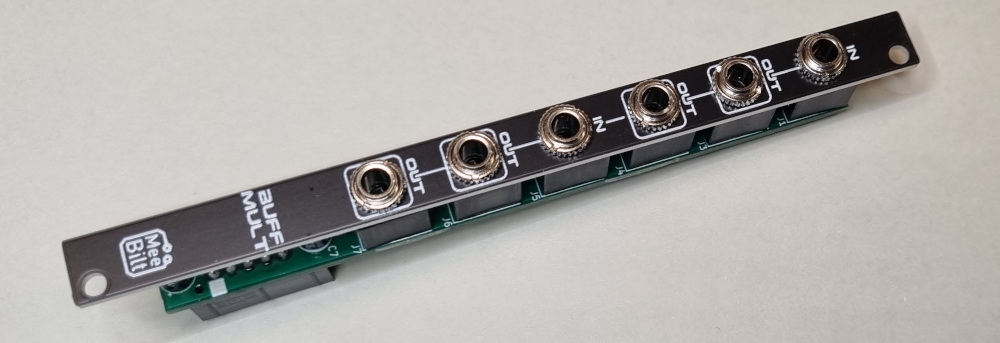

# bmult

This is a dual 1-to-2 buffered multiple that can be used as a 1-to-4 buffered mult if the second input is unconnected.

### Inputs
Two inputs. Second input is normalled to the first one.

### Outputs
Two outputs connected to each input.

### Supply
+12 VDC @ 1 mA  
-12 VDC @ 1 mA

### Dimensions
Height: 3U  
Width: 2HP  
Depth: 23 mm  

### YouTube video
[DIY Eurorack: 2hp Buffered Multiple](https://youtu.be/whNYEe-qcSk)

### Tindie Store item
[Buffered Multiple Eurorack module [Full kit]](https://www.tindie.com/products/27055/)
