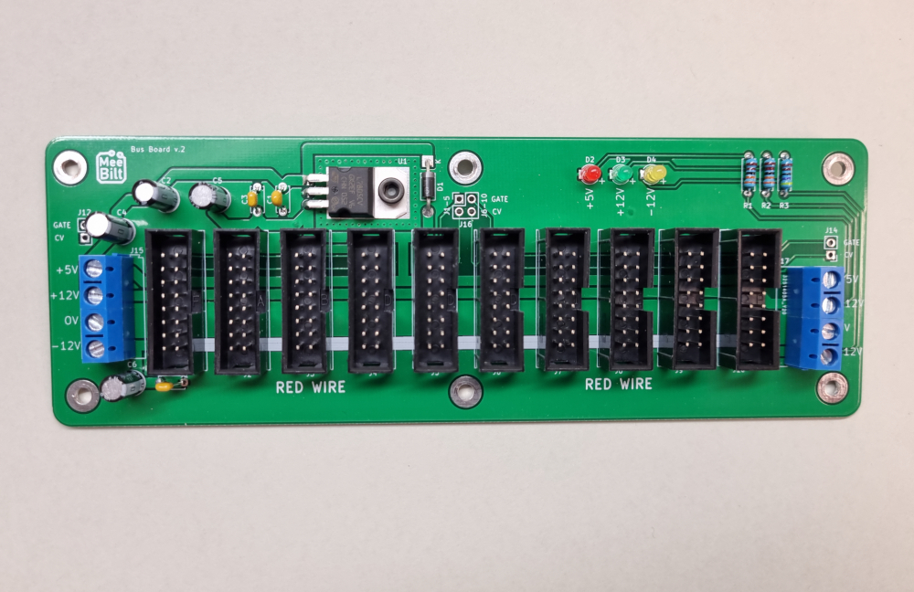

# busboard

A small busboard with room for 10 pcs 16-pin boxed headers and provisions for a +5VDC linear regulator. 
The board has both input and output connectors for the power-rails so two boards can be daisy-chained.

An STL-file mounting plate that fits the board can be downloaded from Thingiverse:
https://www.thingiverse.com/thing:4928068

Relevant YouTube videos:  
[Small Eurorack case DIY - Episode 1: Design](https://youtu.be/Mqk7v33ycSw)  
[Small Eurorack case DIY - Episode 2: Build completed](https://youtu.be/PbSBGpspBiU)  
[DIY 12U Eurorack Case - Episode 1: Design](https://youtu.be/hxyk1j_HRDA)  
[DIY 12U Eurorack Case - Episode 2: Build completed](https://youtu.be/UGUuR_29VmQ)  
  

