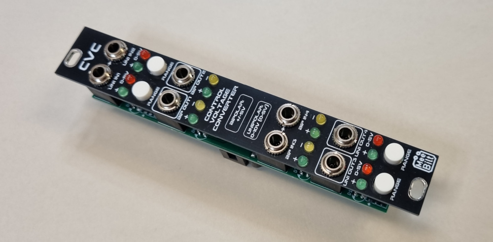

# cvc

This is a four channel Control Voltage Converter, where channel 1 and 2 are Unipolar-to-Bipolar converters and channel 3 and 4 are Bipolar-to-Unipolar converters.

The Unipolar side has a range switch to select between 0-10V or 0-5V. All Unipolar signals have a Green LED to indicate the level and all Bipolar signals have a Green LED for the positive level and a Yellow LED for the negative level.

### Inputs
UNI IN1 - Unipolar Input channel 1  
UNI IN2 - Unipolar Input channel 2 (normalled to UNI IN1)  
BIP IN3 - Bipolar Input channel 3  
BIP IN4 - Bipolar Input channel 4 (normalled to BIP IN3)

### Outputs
BIP OUT1 - Bipolar Output channel 1  
BIP OUT2 - Bipolar Output channel 2  
UNI OUT3 - Unipolar Output channel 3  
UNI OUT4 - Unipolar Output channel 4

### Controls
Each channel has a Unipolar RANGE switch to select between 0-10V or 0-5V and the Red LED is lit up when 0-5V range is selected. 

### Supply
+12 VDC @ 4 mA  
-12 VDC @ 4 mA

### Dimensions
Height: 3U  
Width: 4HP  
Depth: 23 mm  

### YouTube video
[DIY Eurorack: Control Voltage Converter](https://youtu.be/NZt4zt4qYsU)  

### Lectronz Store
TBA