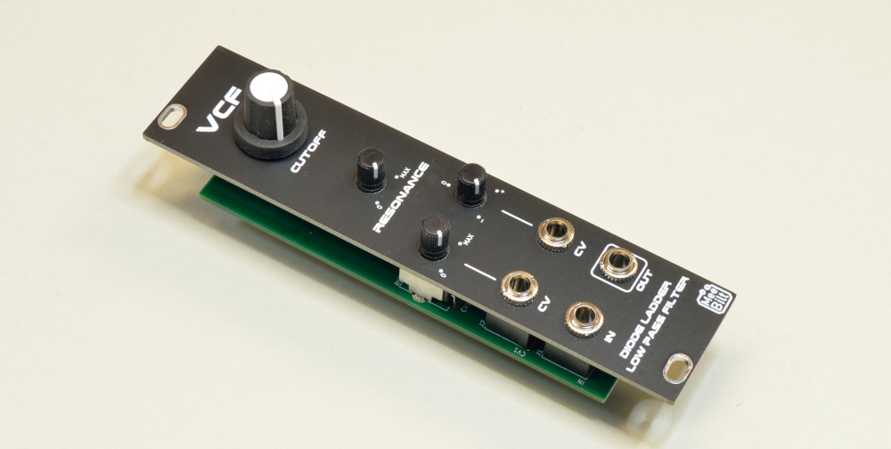

# diode-vcf

This is a diode ladder VCF - original design by Moritz Klein, with a couple of small adaptions made by me. There are two CV inputs, CV1 with an attenuator to control the amount and CV2 with an attenuverter so it's possible to invert the signal as well as controlling the amount of modulation. The filter is a low-pass filter.

Check out Moritz Klein's VCF series on You Tube: https://youtube.com/playlist?list=PLHeL0JWdJLvT1PAqW4TtvxtRoXyk741WM

### Inputs
SIGNAL IN, CV1 and CV2.

### Outputs
SIGNAL OUT

### Controls
Cutoff frequency  
Resonance amount  
CV1 Attenuator control  
CV2 Attenuverter control  

### Supply
+12 VDC @ 12 mA  
-12 VDC @ 12 mA   

### Dimensions
Height: 3U  
Width: 6HP  
Depth: 20 mm  
 
### YouTube video
[Eurorack DIY: Diode Ladder VCF](https://youtu.be/GX_bh88I6nM)
