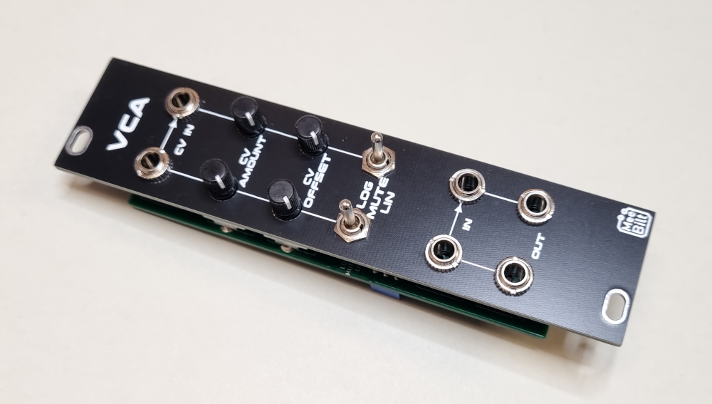

# dvca

This is a dual VCA based on a design from Music From Outer Space, made by Ray Wilson. It support both Lin and Log modes and it is DC-coupled, so it can be used for CV as well as Audio. I have adapted the design a bit by adding the CV Amount attenuator pot, the MUTE Mode and normalled the second channel to the first one. 

The original design is found here: http://musicfromouterspace.com/analogsynth_new/DUALVCA/DLLVCA001.html

### Inputs
CV IN and SIGNAL IN, second channel (right side) inputs are normalled to the first channel (left side).

### Outputs
SIGNAL OUT

### Controls
SPDT toggle switch selecting Lin or Log mode, middle position is MUTE.
CV Amount and CV Offset potentiometers.  

### Supply
+12 VDC @ 12 mA  
-12 VDC @ 12 mA   

### Dimensions
Height: 3U  
Width: 6HP  
Depth: 20 mm  
 
### YouTube video
[Eurorack DIY: Dual VCO module](https://youtu.be/xlG8FzicdFQ)
