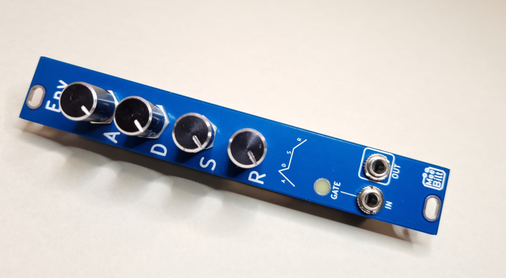

# feitw

This is my version of the René Schmitz "Fastest Envelope in the West" Envelope Generator. 
I only added an LED and tweaked some component values a bit.
The original design can be found here: https://www.schmitzbits.de/adsr.html

### Inputs
One GATE IN (Gate/Trigger) input.

### Outputs
One Envelope OUT jack.

### Level indicator
The LED shows the level of the GATE IN.

### Supply
+12 VDC @ 4 mA   

### Dimensions
Height: 3U  
Width: 4HP  
Depth: 23 mm  
 
### YouTube video
[DIY Eurorack: ADSR Envelope Generator](https://youtu.be/1T7yvPN8B0Q)
