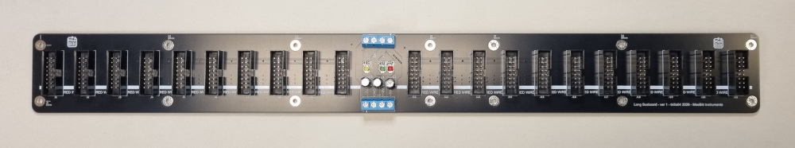

# long_busboard

A long busboard with room for 21 pcs 16-pin boxed headers. 
The board has both input and output screw terminal connectors for the power-rails so two boards can be daisy-chained. There are provisions for three LEDs (power status).

The busboard is recommended for cases with rails 104HP or longer.

Size:  
455 x 50 mm

Screw terminals:  
4-pole  terminal block, 5.00 mm pitch  
Wire gauge; 1.5mm2 (or 14-22 AWG)

Relevant YouTube videos:  
TBA
  
