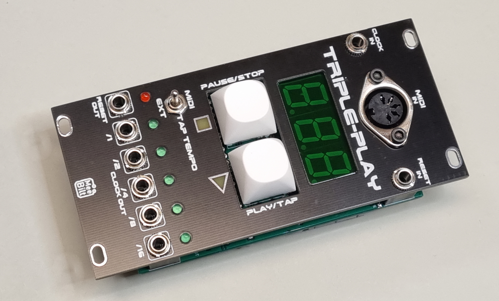

# midi-sync

This module is a Clock Divider/Generator with three syncronisation modes, tape control (START/STOP) buttons, 7-segment display. Clock and Reset inputs and 5 clock divider outputs and a reset output.

### Functions
Three sync modes, selectable via toggle switch:
 - Internal (tap tempo)
 - External clock
 - MIDI clock 

Large PLAY/TAP and STOP/PAUSE buttons to start, pause and stop/restart a pattern. Used for External Sync and Internal (Tap Tempo) modes.

Large three digit 7-segment display that shows BPM. The display shows "TAP" while waiting for tap tempo input, which is done my tapping the PLAY/TAP button 8 times.

The module recognizes TIMING CLOCK, START, CONTINUE and STOP MIDI Realtime System messages. The display shows the BPM in MIDI play mode and -||- in paused or stopped mode.

### Inputs
Two inputs, External CLOCK and External RESET.

### Outputs
RESET output and 5 Clock Divider outputs (/1 /2 /4 /8 and /16)

### Supply
+12 VDC @ 60 mA

### Dimensions
Height: 3U  
Width: 12HP  
Depth: 33 mm  

### YouTube video
[DIY Eurorack: MIDI Sync Clock Generator (Episode 1)](https://youtu.be/5i79Hs8257g)  
[DIY Eurorack: MIDI Sync Clock Generator (Episode 2)](https://youtu.be/N1wAiYwCmvM)
