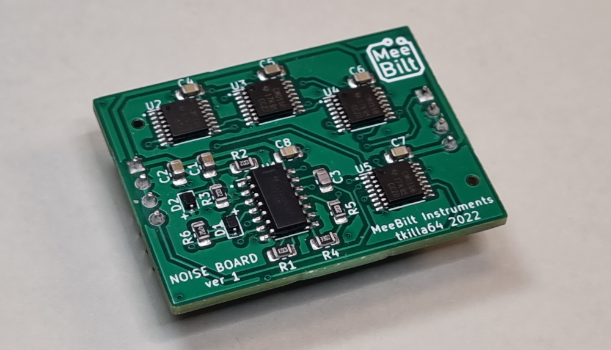

# noise_board

This is the 909 noise circuit designed as a piggy-back board.
It's intended to be used together with my 909 drum modules, but it can ofcourse be used as noise source in other designs.

### Pinout (top view):    

 | Left Header  | Right Header |
 | ------------- | ------------- |
 | Pin 1: +12V   | Pin 1: Noise Out  |
 | Pin 2: GND    | Pin 2: GND |
 | Pin 3: GND    | Pin 3: GND  |
 | Pin 2: Noise Out  | Pin 4: +12V  |

### Inputs
+12VDC, supplied by the host module.

### Outputs
Raw noise signal (white noise).

### Supply
+12 VDC @ 5 mA

### Dimensions
Height: 30 mm  
Width: 40 mm  
Depth: 12 mm  

### YouTube video
[DIY Eurorack: 909 Snare Episode 2](https://youtu.be/z5UH8hfUGwE)
