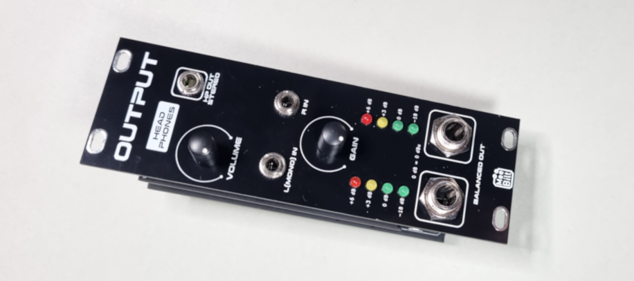

# output
  
An output module that converts the Eurorack levels into professional line levels with balanced 6.3mm TRS-jack outputs. 

The module incorporates a VU meter, gain trimmer and a headphones amplifier with separate volume control, designed to drive 250 ohm studio headphones, with 3.5mm HP jack. Right input channel is normalled to the left input channel.

### Inputs
Left channel (MONO)  
Right channel  

### Outputs
Balanced Left (6.3mm TRS Jack)  
Balanced Right (6.3mm TRS Jack)  
Headphones Stereo (3.5mm Jack)  

### Controls 
Headphones Volume  
Gain trimmer

### Indicator
VU meter, 4 LEDs per channel  
(0 dB = 0 dBu)

### Supply
(55 ohm Headphones @ Max volume)  
+12 VDC @ 85 mA  
-12 VDC @ 85 mA   

### Dimensions
Height: 3U  
Width: 8HP  
Depth: 35 mm  
 
### YouTube videos
[DIY Eurorack: Output module](https://youtu.be/tSoWA5eOjx4)  
[DIY Eurorack: Output module Build video](https://youtu.be/rYu1KfZ926k)

### Tindie store item
[Audio Output Eurorack module [Full Kit]](https://www.tindie.com/products/30807/)  
