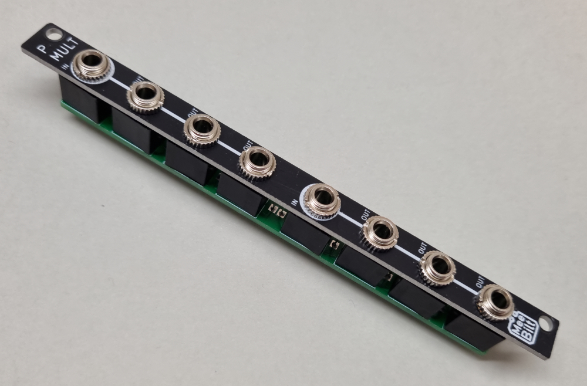

# pmult

Eurorack Passive Multiples (Mult)

A simple but yet crucial module in any Eurorack case. The passive multiple "copies" one input to many outputs.
The configuration is two independent 1-to-3 or one 1-to-6 mults in 2HP. Since it's passive in needs no power.

YouTube video:  
[Dirt-cheap Passive Multiples for Eurorack](https://youtu.be/mRP7qRoAo7c)  
[Passive Multiple Build and Demo](https://youtu.be/xBq7q6ZaBjY)

Tindie store:  
https://www.tindie.com/products/28426/