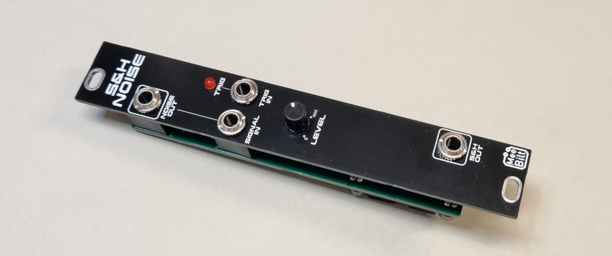

# snh_noise

This is a Sample and Hold module with an input attenuator and a trigger indicator. There is also a white noise source added and the output is normalled to the signal input.

### Inputs
TRIG IN  
SIGNAL IN

### Outputs
NOISE OUT  
SIGNAL OUT

### Controls
Trigger indicator (LED)  
INPUT LEVEL

### Supply
+12 VDC @ 6 mA  
-12 VDC @ 6 mA   

### Dimensions
Height: 3U  
Width: 4HP  
Depth: 20 mm  
 
### YouTube videos
[DIY Eurorack: Sample & Hold + Noise](https://youtu.be/0EW2OIvYBs8)  
