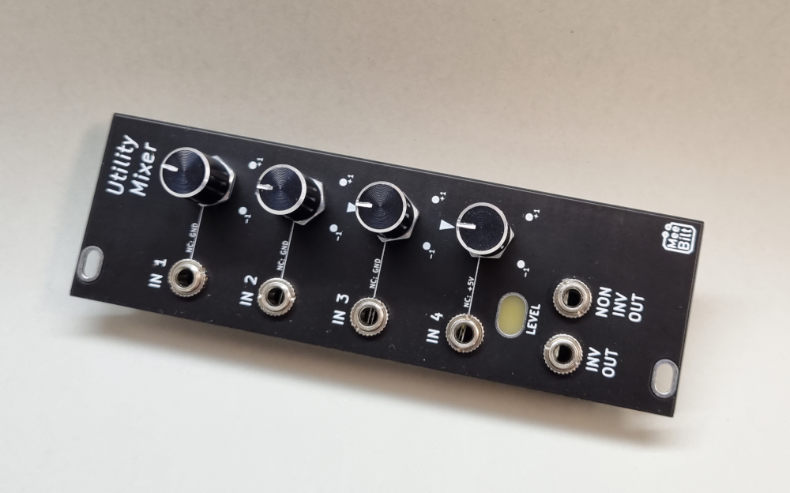

# umix

This Utility Mixer is a "Swiss Army-knife" for mixing modulation sources together and adding an offset voltage, but it can ofcourse be used as an 
audio-mixer for mixing together oscillators, noise and other sources. The mixer is DC-coupled.

### Inputs
There are 4 attenuverter inputs with a gain of +/- 1.0 IN1, IN2 and IN3 is connected to GND and IN4 is connected to the voltage reference 
if nothing is connected to the input jack.

### Outputs
Two output jacks; inverting and non-inverting

### Level indicator
The output level is shown on a LED indicator.
Levels below 1 dB are shown with a Green light, between 1 and 4 dB is shown with Amber and more than 4 dB is Red.
0 dB = 5.0 Vp-p

### Voltage reference
There is a +5.00 VDC Voltage reference connected to IN4.

### Supply
+12 VDC @ 29 mA  
-12 VDC @ 13 mA  

### YouTube video
[DIY Eurorack Utility Mixer](https://youtu.be/52_5lXzpGxY)

